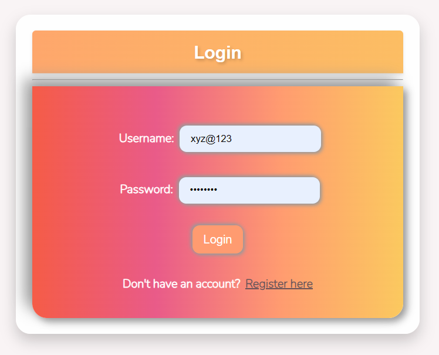
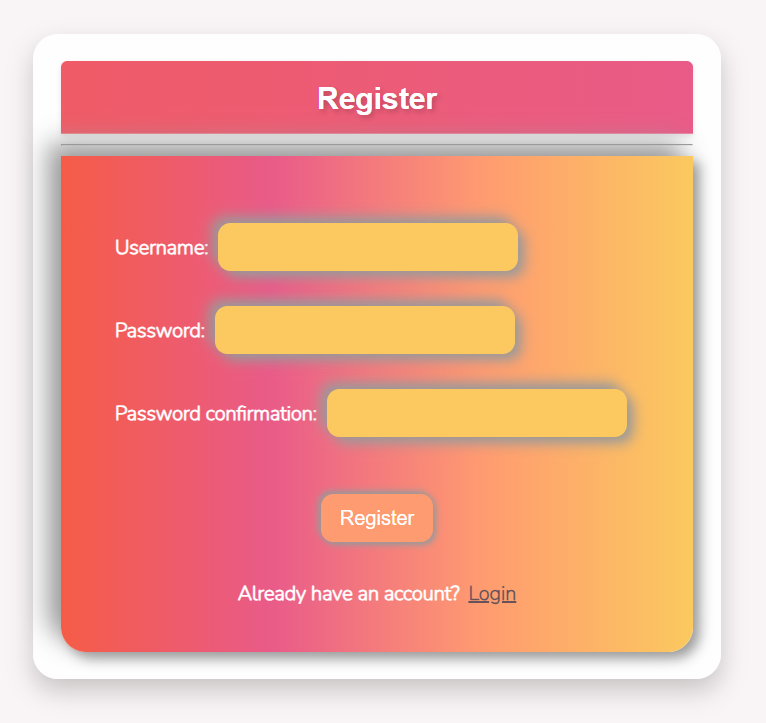
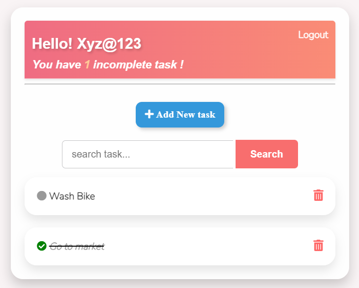

# My Taskpad - ToDo List App

**My Taskpad** is a simple and intuitive ToDo list app built using Django. It allows users to register an account, log in, manage their tasks, and update or delete them as needed. The app offers a smooth UI/UX, making it easy to organize and track your tasks effectively.

## Features

1. User Registration: New users can create an account with a unique username and password.
2. User Login: Existing users can log in to their accounts.
3. User Registration Link: The login page provides a link for new users to easily navigate to the registration page.
4. Task List Display: After logging in, users are presented with a list of their tasks.
5. Add Task: Users can add new tasks to their list.
6. Search Task: A search bar is available for users to quickly find specific tasks.
7. Logout: Users can log out securely.
8. Update Task: Clicking on a task allows users to update its details.
9. Delete Task: Users can delete tasks by clicking on the delete button.

## Screenshots


<!--  -->


<!--  -->


<!--  -->

## How to use
Follow these instructions to set up and run **My Taskpad** on your local system:

1. **Clone the Repository**: Open your terminal and run the following command to clone the GitHub repository:

```
git clone https://github.com/your-username/my-taskpad.git
```

2. **Install Dependencies** : Navigate to the project's root directory and install the required dependencies using pip:

```
cd my-taskpad
pip install -r requirements.txt
```

3. **Database Setup** : By default, the app uses SQLite for the database. Apply the initial migrations to set up the database:
```
python manage.py migrate
```
4. **Create Superuser** (Optional): If you want to access the Django admin interface, you can create a superuser using the following command:

``` 
python manage.py createsuperuser
```
5. **Run the Development Server** : Start the development server with the following command:
```
python manage.py runserver
```

6. **Access the App** : Open your web browser and paste this link to access My Taskpad.
```
http://127.0.0.1:8000/
```

## Happy Task Managing with My Taskpad!
